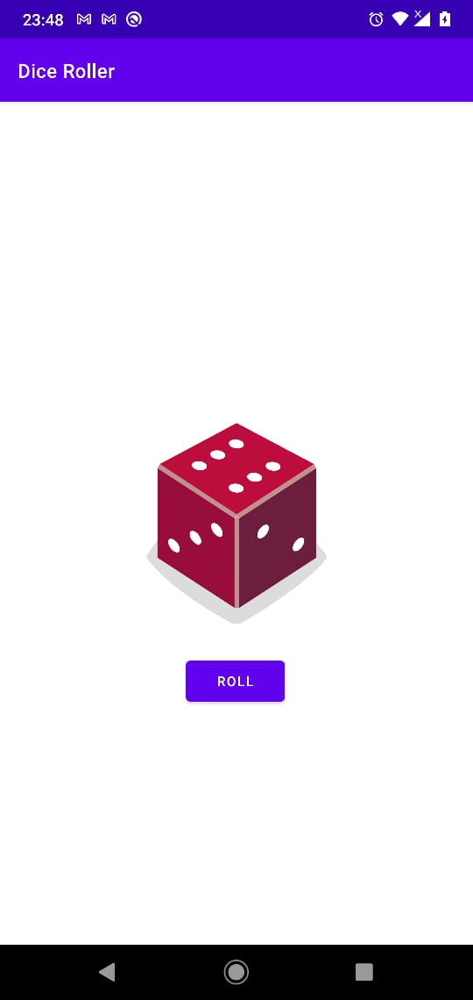

# Dice-Roller

## This is a basic android app written in kotlin
## -> there is a button, on click will generate a random number between 1 to 6
## -> based on random result the dice image on screen will change

